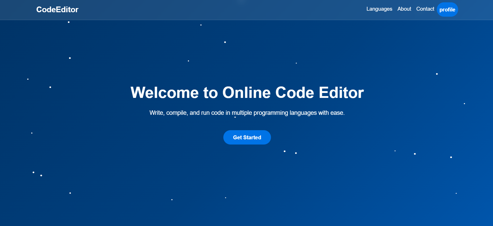
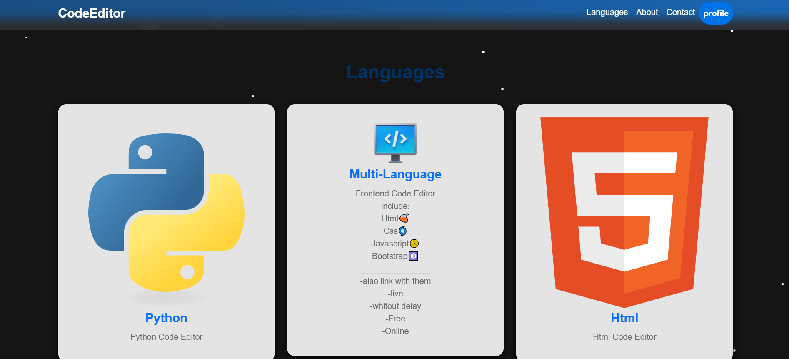
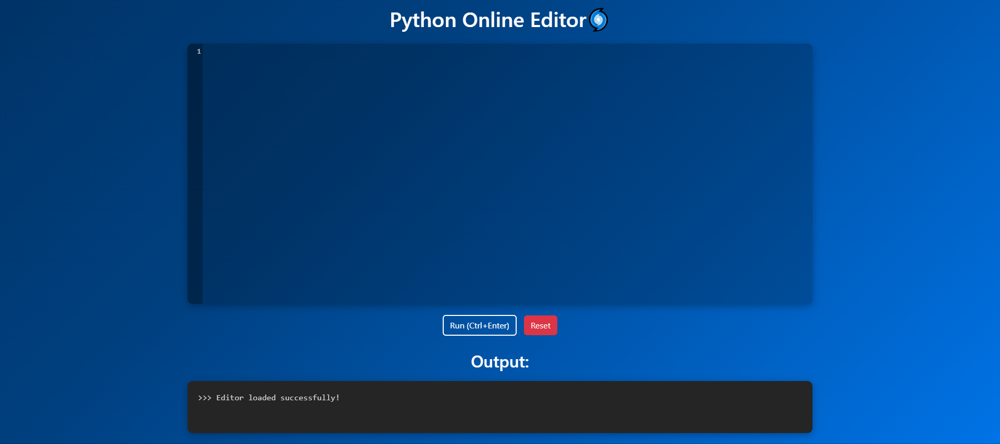
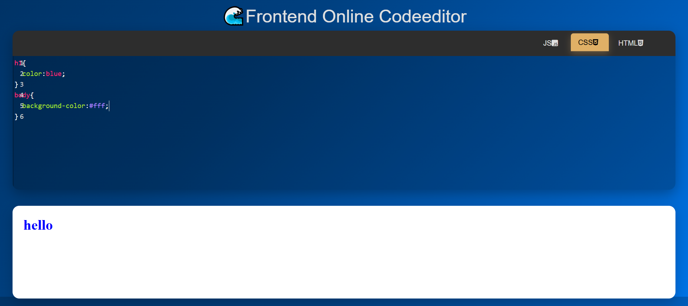

# Online_CodeEditor_Website
 Online CodeEditor Website with javascript and django
This project is developed using Django and JavaScript.
This project allows users to write, run, and save their codes online & live.


Features:

Online Code Editing: Supports multiple programming languages.

-Code Execution: Ability to execute code and view the output.

-Simple and user-friendly user interface.

-Ability to register and log in to the site

-Ability to view and change profile

-live output

-Syntax coloring

-Automatic code suggestion

-and....
______________________________________________
Prerequisites
Python 3.x
Django 
javascript
bootstrap
______________________________________________
Virtualenv (to create a virtual environment)

Installation and Setup
1. Install Python and Django
First, make sure that Python 3.x is installed on your system. Then you can install Django using pip.

```
# Install Django
pip install django
```
______________________________________________
2. Create a virtual environment
To avoid interference with other projects, it is better to use a virtual environment.

```
# Install virtualenv if not present
pip install virtualenv
# Create virtual environment
virtualenv venv
# Activate virtual environment
# On Windows:
venv\Scripts\activate
# On Linux or Mac:
source venv/bin/activate
```
______________________________________________
3. Install requirements
The requirements.txt file contains all the libraries required for this project. You can install them with the following command.

```
pip install -r requirements.txt
```
______________________________________________
4. Run the project
After installing the requirements, you can run the project.

```
# Run the development server
python manage.py runserver
```
Then you can visit http://127.0.0.1:8000/ in your browser to view the project.

-also you can create super user for management admin panel:
```
python manage.py createsuperuser
```
______________________________________________






______________________________________________
Next updates (comming soon):

-Add editor for other languages (+10 languages)
-Improvement UI/UX
-Ability to save codes and projects
-Publish projects globally
-Possibility of developing the project as a team
-Chat room
-Dedicated panel
-social media for coders
-and etc...
______________________________________________
______________________________________________
Please give stars and wait for the next version and if you have any ideas, contribute to the project♡.
Email for discussion: navidnavidjouy.programming@gmail.com